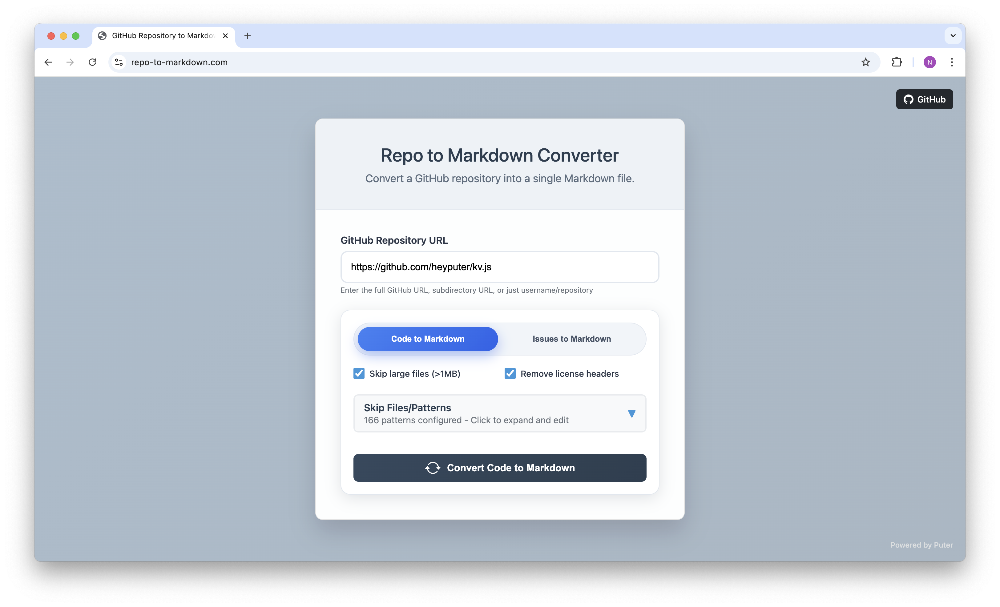

<h1 align="center">
  <a href="https://repo-to-markdown.com" target="_blank">Repo to Markdown Converter</a>
</h1>

<p align="center">Convert any GitHub repository into a single Markdown file - AI-ready codebase export!</p>

<p align="center">
  
</p>

## About

This is a simple, client-side tool that converts GitHub repositories into a single Markdown file. Perfect for feeding codebases to AI models, code analysis, documentation, or creating comprehensive overviews of your projects. The tool fetches repository files using the GitHub API and concatenates them with proper formatting and file headers.

The browser networking capabilities are provided by [Puter.js](https://developer.puter.com/).

<br>

## Getting Started

### Online Version
Access the hosted version at [repo-to-markdown.com](https://repo-to-markdown.com)

### Local Development

Clone the repository: 

```bash
git clone https://github.com/puter-apps/repo-to-markdown.git
```

and open the `src/index.html` file in your browser. No hosting or server is required.

## Default Skip Patterns

The tool comes pre-configured to skip common files that are typically not needed in code analysis:

- Dependencies: `node_modules/`, `package-lock.json`, `yarn.lock`, etc.
- Build artifacts: `dist/`, `build/`, `*.min.js`, `*.bundle.js`
- Configuration files: `.env*`, `*.config.js`, `tsconfig.json`
- Version control: `.git/`, `.gitignore`, `.gitattributes`
- Media files: `*.png`, `*.jpg`, `*.mp4`, `*.pdf`
- Documentation: `*.md`, `LICENSE*`

All patterns are customizable through the web interface.

## License

This project is licensed under the GNU Affero General Public License v3.0 - see the [LICENSE](LICENSE) file for details. 